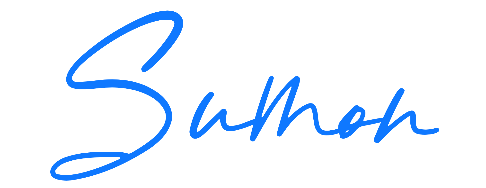

# Portfolio Website



## Overview

A modern, responsive portfolio website showcasing my software development projects and skills. Built with React, TypeScript, and Material UI, this portfolio presents my work and experience in an engaging and professional way.

## Features

- **Responsive Design**: Looks great on all devices from mobile to desktop
- **Dark/Light Mode**: User-selectable theme for comfortable viewing
- **Project Showcase**: Detailed project cards with technologies, descriptions and links
- **Interactive UI**: Engaging user experience with animations and transitions
- **Performance Optimized**: Fast loading times and smooth scrolling

## Preview


## Technologies Used

### Frontend
- React 18
- TypeScript
- Material UI v5
- Framer Motion for animations

### Development Tools
- Vite for fast development and building
- ESLint for code quality
- Prettier for code formatting
- Git for version control

## Getting Started

### Prerequisites

- Node.js (v14+)
- npm or yarn

### Installation

1. Clone the repository
   ```bash
   git clone https://github.com/yourusername/portfolio.git
   cd portfolio
   ```

2. install dependencies and run
    ```bash
    cd frontend
    npm install
    npm run dev
    ```

### License
- This project is licensed under the MIT License - see the LICENSE file for details.

### Acknowledgements

- Thanks to all the open-source libraries that made this project possible
- Material UI team for the excellent component library
- React community for their continued support and innovation
